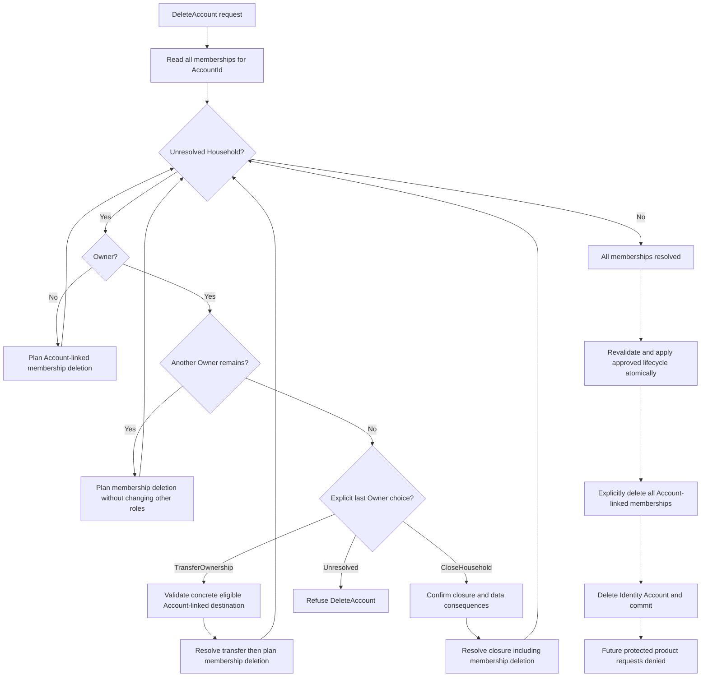

# HomePlatform Deletion Design

Status: **ADOPTED product/domain decisions; Account-reference integrity IMPLEMENTED / VERIFIED locally; lifecycle operations NOT YET IMPLEMENTED**

Decision date: **2026-09-13**

Initial decision evidence: `main@07eeb12`; source inspection on 2026-09-13.
Account-reference review: **2026-09-14**, `main@bc03a00` plus the user-owned
uncommitted implementation and tests; local PostgreSQL/build evidence below.
No deployed database or real-user data was inspected.

## Purpose

This is the canonical source for Account deletion, Household lifecycle,
ownership, shared-data boundaries, database guardrails, and access after
deletion. It complements [ADR 0006](../architecture/adr/0006-separate-account-and-household-membership-identity.md).
An Owner is a Household role, not ownership of another person's personal data.

Status vocabulary across the privacy documents:

- **ADOPTED:** a product/domain rule or architecture direction has been decided.
- **PROPOSED:** a candidate requiring a later decision; not a binding rule.
- **OPEN:** no final decision exists.
- **IMPLEMENTED / VERIFIED locally:** current code and local tests establish the
  stated behavior; this does not certify deployment or operational controls.
- **NOT YET IMPLEMENTED:** the required behavior is absent; adopting a rule
  does not prove runtime enforcement.

The task brief supplies the adopted decisions and the prior audit's requested
privacy-document set. No standalone HomePlatform privacy audit was found in
the repository. The initial supporting documents use the brief and live
repository evidence; they do not infer missing audit findings or legal facts.

## Adopted Decisions

1. Account and Household have separate lifecycles. DeleteAccount,
   LeaveHousehold, TransferOwnership, and CloseHousehold are distinct operations.
2. Membership does not imply ownership or administrative authority. A
   HouseholdMember never automatically becomes Owner because someone leaves.
3. TransferOwnership explicitly selects a concrete eligible Account-linked
   person. Acceptance by the destination Owner is **OPEN**.
4. Owner requires a real Account. `Role = Owner` with `AccountId = null` is
   invalid, including after Account deletion.
5. A continuing Household must retain an Owner. A departing last Owner must
   explicitly transfer ownership or close the Household before Account deletion.
6. A Household used only by the departing Account may be explicitly closed
   within DeleteAccount when no other person's/shared data needs to continue.
   Clearly inform the user that Household data will be deleted. No grace period
   is adopted; do not build one without a later concrete product decision.
7. Loginless HouseholdMembers can represent real people, including children.
   A null AccountId does not mean anonymous or outside deletion/privacy scope.
8. Account deletion must not automatically cascade-delete a Household that
   other Account-linked people legitimately continue using. Shared record
   ownership is distinct from Account ownership.
9. Require a real nullable `HouseholdMember.AccountId -> AspNetUsers.Id` foreign
   key with rejecting/guarding deletion behavior. IMPLEMENTED / VERIFIED locally
   on 2026-09-14; see Database Guardrails.
10. Do not use Account-to-HouseholdMember `CASCADE DELETE` or automatic
    `SET NULL` as lifecycle logic. Resolve relations explicitly first.
11. After DeleteAccount successfully commits, new protected product requests
    from that Account must be denied, including with an unexpired access token.
12. DeleteAccount is normal product lifecycle; an Article 17 erasure request
    is a separate privacy/legal request with potentially different scope.
    Reuse concrete deletion logic where appropriate, without a generic
    GdprService/PrivacyService.
13. **Membership fate is RESOLVED for DeleteAccount:** after ownership rules
    are resolved, explicitly delete every HouseholdMember linked to the deleted
    AccountId across all Households, then delete Identity/ApplicationUser and
    Account-owned data. Never silently convert those memberships to loginless.
14. Deleting an Account and its memberships does not automatically delete every
    record it created or interacted with. Shared records follow explicit
    feature/data-type lifecycle rules; remove unnecessary personal references
    from records that survive under those rules.
15. Every persisted feature must define scope, personal references,
    LeaveHousehold, DeleteAccount, CloseHousehold and surviving/person-dependent
    record behavior before its design is lifecycle-complete.
16. Do not retain personal data “just in case”. Without a documented continuing
    purpose, delete the relevant personal data by default. Do not infer a
    cascade deletion of legitimate Household-shared records from creator
    deletion; a feature-specific lifecycle decision is required.

## Account vs Household Lifecycle

| Operation | Scope and adopted boundary | Implementation status |
|---|---|---|
| DeleteAccount | Resolve ownership rules, explicitly delete all Account-linked HouseholdMember memberships across all Households, then delete Identity/ApplicationUser and Account-owned data; no conversion to loginless or implicit Household closure | NOT YET IMPLEMENTED |
| LeaveHousehold | Resolve departure from one Household while preserving the Account and other memberships; protect the last Owner | NOT YET IMPLEMENTED |
| TransferOwnership | Explicitly choose an eligible Account-linked destination; no automatic promotion | NOT YET IMPLEMENTED |
| CloseHousehold | Explicitly end a Household through its approved shared-data/privacy policy; not an implicit side effect of deleting an Account | NOT YET IMPLEMENTED |

These are use-case names, not approved endpoint contracts. Decide exact API
shapes during implementation review. DeleteAccount membership fate is
**ADOPTED: delete, never automatically convert to loginless**. This does not
decide standalone LeaveHousehold behavior or concrete future feature lifecycles.
A stable MembershipId does not mandate retaining a Membership or personal
attribution after deletion.

## DeleteAccount Across Multiple Households

One Account can have memberships in multiple Households. Read and resolve
**all** memberships for its AccountId, never only the client-selected active or
current Household. Evaluate the Account's role independently in each Household.

For example, if Account A has memberships in Household 1, Household 2 and
Household 3, DeleteAccount must resolve ownership and delete all three linked
memberships. None is silently retained with a null AccountId.

| Situation in one Household | Required resolution |
|---|---|
| Member or Guest | Delete the Account-linked membership as part of DeleteAccount; do not change another person's role |
| Owner with another Owner | Household continues; delete the departing Account's membership without changing any other person's role |
| Last Owner | Explicit TransferOwnership to an eligible Account-linked person, or explicit CloseHousehold, before deleting the Account-linked membership |
| No memberships | No Household resolution is needed before the remaining Account deletion work |

An unresolved last-Owner case blocks DeleteAccount. Revalidate the full plan
and relevant invariants when committing so concurrent membership/Owner changes
cannot bypass them. The approved ownership/shared-data lifecycle, deletion of
all Account-linked memberships and Identity deletion must succeed atomically
or leave no partial deletion. Exact concurrency and transaction mechanics are
**OPEN implementation details**.

## Ownership Rules

- Member, Guest, partner, grandparent, or child status never implicitly grants
  Owner authority. There is no “last Owner disappears, pick another Member” rule.
- TransferOwnership must identify a concrete eligible destination with a valid
  Account link. Loginless HouseholdMembers cannot be that destination.
- The current [HouseholdMember constructor](../../backend/src/HomePlatform.Domain/Household/HouseholdMember.cs)
  rejects Owner with null AccountId. This is a construction invariant, not proof
  of database referential integrity or implemented transfer/leave/deletion flows.
- Destination acceptance is **OPEN** and may become a separately decided flow.

## Last Owner Flow

The user must resolve each last-Owner Household with explicit transfer or
closure. A Household with only the departing Account may be closed as part of
DeleteAccount only with clear deletion information and the explicit choice.
Counting Account-linked members alone is insufficient: check for loginless
people and shared data as well. A Household never continues ownerless.

The diagram describes required behavior, not existing code. Invalid choices or
unresolved policies cannot advance to commit. Resolution steps prepare the
approved deletion plan; they do not authorize partial commits per Household.
No arrow performs automatic Owner promotion.

## Loginless Members and Children

`HouseholdMember.AccountId` remains conceptually nullable: loginless membership
creation/management is a separate supported domain flow. DeleteAccount deletes
existing Account-linked memberships; it does not silently turn them into
loginless memberships or require AccountId to become non-nullable.

`AccountId = null` expresses identity separation, not anonymization. A loginless
HouseholdMember may represent a child or another real person even though the
current model stores no name, birth date, or family-relationship field on it.

If the last Owner deletes their Account and loginless people remain, transfer
to an eligible Account-linked person or explicitly close the Household. Never
promote a loginless person or leave an ownerless Household. CloseHousehold must
handle their data under the approved privacy/shared-data policy. The final
child-account policy and any unresolved detailed data fate remain **OPEN**.

## Shared Data

**ADOPTED:** Account and membership deletion does not automatically delete all
records the Account created or interacted with. “Created by an Account” does
not establish Account ownership. Classify the record and its person references
separately, including across multiple Households:

| Category | Adopted lifecycle boundary |
|---|---|
| Account-owned data | Email, username, password hash and security/account state are deleted with Identity/ApplicationUser |
| Membership/person-specific data | Every HouseholdMember linked to the deleted AccountId is deleted after ownership resolution; other person-specific records follow their explicit feature lifecycle |
| Household-scoped/shared domain data | A record may survive where an explicit feature/data-type rule establishes a continuing legitimate Household product purpose |
| Personal references inside shared data | Remove references to the deleted person that are no longer necessary, even when the shared record survives |

Data about other people, including loginless children, must still be assessed
separately from the departing person's data. Owner is a Household authority
role, not ownership of another person's personal data. **Shared record
ownership ≠ Account ownership.**

Decide lifecycle explicitly per feature/data type. Do not use a generic runtime
heuristic such as “Does someone still use this?” to decide which records
survive. If no continuing purpose for personal data is documented, delete that
personal data by default; do not retain it “just in case”. This is not a rule
to automatically cascade-delete legitimate shared records when their creator
is deleted. An undecided feature lifecycle is an incomplete design, not a
license to invent retention or cascade behavior at runtime.

### Personal references in surviving records

Remove unnecessary person references under the feature's lifecycle rule.
Define how missing attribution is presented; do not retain a name/email merely
to show who the deleted person was or store a fake replacement identity.

**ILLUSTRATIVE / NOT YET ADOPTED FEATURE RULE:** a future Task could retain its
Household content after removing creator attribution:

| Field | Before | After |
|---|---|---|
| HouseholdId | H1 | H1 |
| Title | Køb mælk | Køb mælk |
| CreatedByMembershipId | Membership being deleted | null |

The UI could display **“Tidligere medlem”** for missing attribution. By default,
that is UI presentation, not a stored replacement identity. Tasks are NOT YET
IMPLEMENTED; this example does not adopt a Task lifecycle, field/nullability
mapping, or assignment policy.

Use **“personal reference removed”**, **“personreference fjernet”** or
**“attribution removed”** for this outcome. Setting AccountId, MembershipId or
CreatedBy to null does not by itself establish anonymous data. Only claim
anonymization when it has been verified that the remaining data cannot identify
the person directly or indirectly, including through free text or other links.
Nulling a reference is not a general conclusion about GDPR compliance.

### Every persisted feature must define its lifecycle

**ADOPTED engineering/product rule:** the design of every new feature with
persisted data must answer the following before it is lifecycle-complete:

| Design question | Required decision |
|---|---|
| Scope / ownership | Classify the record as primarily Account-, Membership/person-, or Household-scoped; creator identity alone does not decide ownership |
| Personal references | Identify person fields/links, including CreatedByMembershipId, AssignedToMembershipId, ParticipantMembershipId, AccountId and free-text attribution where relevant |
| LeaveHousehold | Define what happens when the person leaves one Household but retains their Account |
| DeleteAccount | Define what happens when the Account and its linked memberships disappear from every Household |
| CloseHousehold | Define what happens when the Household itself closes |
| Surviving shared record | Retain the record under the explicit feature rule, remove unnecessary personal references, define missing-attribution UI, and review export/retention/privacy consequences |
| Person-dependent record | Delete the record under its feature lifecycle when it has no continuing product purpose without the person |

### Feature lifecycle checklist

For each new persisted feature:

- [ ] Record scope classified: Account / Membership / Household
- [ ] Personal-reference fields identified
- [ ] LeaveHousehold behavior defined
- [ ] DeleteAccount behavior defined
- [ ] CloseHousehold behavior defined
- [ ] Missing/deleted-person attribution UI defined if relevant
- [ ] Export impact reviewed
- [ ] Retention impact reviewed
- [ ] Privacy notice/data inventory impact reviewed
- [ ] Deletion/integration tests planned
- [ ] Shared records do not expose removed personal references unintentionally

A feature containing persisted personal/shared data is not lifecycle-complete
until these questions have been answered. Planning tests here does not claim
that deletion behavior exists or has been verified.

### Future feature examples

**ILLUSTRATIVE / NOT YET ADOPTED FEATURE RULES.** These features are NOT YET
IMPLEMENTED; concrete scope, attribution/history and lifecycle remain OPEN.

| Feature | Possible direction to assess during feature design |
|---|---|
| Shopping | ShoppingList may be Household-scoped; creator deletion need not delete the list, while personal creator attribution may be removable |
| Events | An Event may be Household-scoped with removable creator attribution; the departing person's participation is a separate person-specific relationship |
| Tasks | A Task may survive creator deletion with creator attribution removed; assignment to the departing person requires an explicit Task lifecycle rule |
| Routines | Scope may be Household- or person-oriented; do not decide it before Routines is designed |

Concrete attribution/history rules and immediate hard deletion of every future
record type on CloseHousehold remain **OPEN**. See the
[data inventory](DATA-INVENTORY.md) and [retention policy](RETENTION-POLICY.md).

## Database Guardrails

**IMPLEMENTED / VERIFIED locally:** [HouseholdMemberConfiguration](../../backend/src/HomePlatform.Infrastructure/Persistence/Configurations/HouseholdMemberConfiguration.cs)
maps nullable `AccountId -> AspNetUsers.Id` with EF `DeleteBehavior.ClientNoAction`.
The [migration](../../backend/src/HomePlatform.Infrastructure/Persistence/Migrations/20260913183105_AddHouseholdMemberAccountReference.cs),
its designer and [model snapshot](../../backend/src/HomePlatform.Infrastructure/Persistence/Migrations/HomePlatformDbContextModelSnapshot.cs)
agree. The migration adds `IX_HouseholdMember_AccountId` and
`FK_HouseholdMember_AspNetUsers_AccountId` with PostgreSQL `NO ACTION`, without
CASCADE or SET NULL. The AccountId index supports cross-Household Account lookup;
the existing `(HouseholdId, AccountId)` unique index retains its separate scoped
uniqueness role. Domain remains independent of EF and Identity types.

[AccountReferenceIntegrityTests](../../backend/tests/HomePlatform.IntegrationTests/Households/AccountReferenceIntegrityTests.cs)
prove valid Identity references, null Member/Guest links, rejection of unknown
Accounts, tracked/untracked deletion guards for Owner/Member/Guest, deletion of
an unreferenced Account and optional FK metadata (12 cases).
[AccountReferenceMigrationTests](../../backend/tests/HomePlatform.IntegrationTests/Households/AccountReferenceMigrationTests.cs)
prove upgrade from `20260904100319_AddIdentityPersistence`: valid data remains
intact and the FK is enforced; dangling data makes the migration fail with
unchanged memberships, AccountIds, Accounts and migration history. It does not
silently null a link, delete a membership or invent an Account. Inspect actual
existing rows before an environment upgrade; those rows and deployment state
are NOT VERIFIED by local tests. Build passed without warnings/errors; the full
solution passed **119/119: Domain 25, Application 16, Integration 78; 0 skipped**.

**ADOPTED; DeleteAccount NOT YET IMPLEMENTED:** explicitly delete all memberships
linked to that AccountId after ownership resolution and before Identity-account
deletion. Do not automatically convert them to loginless memberships. Nullable
AccountId remains supported for separately created/managed loginless members.
The guarding FK does not implement ownership lifecycle or protected-request
current-Account validation.

Do not use Account-to-HouseholdMember `CASCADE DELETE`: it can blindly remove
membership/shared identity. Do not use automatic `SET NULL`: it can leave
Owner with null AccountId. Database behavior cannot choose domain ownership.

The current [HouseholdConfiguration](../../backend/src/HomePlatform.Infrastructure/Persistence/Configurations/HouseholdConfiguration.cs)
has a separate Household-to-HouseholdMember cascade. Identity's own dependent
tables also have cascade relationships. These are existing schema facts, not
an Account-to-HouseholdMember cascade or authorization to close a Household.
The approved CloseHousehold flow must assess its own data consequences.

## Authentication After Deletion

**ADOPTED:** after DeleteAccount successfully commits, new protected product
requests from the deleted Account must be denied immediately. Waiting for
access-token expiry does not satisfy this rule.

**Current gap:** [HttpCurrentAccount](../../backend/src/HomePlatform.Api/Identity/HttpCurrentAccount.cs)
only validates authenticated subject claims. The [bearer registration](../../backend/src/HomePlatform.Infrastructure/DependencyInjection.cs)
adds no current-Account check. The framework's
[BearerTokenHandler at v10.0.11](https://github.com/dotnet/aspnetcore/blob/v10.0.11/src/Security/Authentication/BearerToken/src/BearerTokenHandler.cs)
validates a protected access ticket and expiry without reloading its Account.
Thus an existing opaque access token can currently remain usable until expiry.
This is source/framework evidence about access validation. Direct database
deletion guard tests do not prove the future DeleteAccount or post-deletion
request-denial behavior.

**Required implementation:** verify current Account existence/validity for
protected product requests, and resolve current Household membership and role
for Household authorization. Token authentication alone proves neither current
Account existence nor resource access. This requires no custom session/OAuth
framework. Exact access-token lifetime remains **OPEN**.

[IdentityAccountRefresh](../../backend/src/HomePlatform.Infrastructure/Identity/IdentityAccountRefresh.cs)
already validates expiry and the current user's security stamp before renewal.
That refresh check is distinct from access-request validation. Future deletion
tests must prove denial with a previously issued unexpired access token and
rejection of refresh after Account deletion; existing refresh tests are not
DeleteAccount evidence.

## GDPR Erasure Relationship

**ADOPTED product distinction:** DeleteAccount is the normal Account lifecycle.
An Article 17 erasure request is a privacy/legal request about personal data;
its scope can differ and include a person without an Account. Article 17 has
conditions and exceptions; a product button does not settle their application.
See [GDPR Article 17](https://eur-lex.europa.eu/eli/reg/2016/679/oj/eng).

Reuse concrete deletion logic where the approved outcomes match, while allowing
different entry points and identity/authority verification. Do not create a
generic GdprService/PrivacyService or treat the last-Owner product flow as a
complete legal-request procedure. Exact Article 6 basis per processing
activity remains **OPEN** in the [processing register](PROCESSING-REGISTER.md).

## Open Decisions

DeleteAccount membership fate is **RESOLVED**: delete every Account-linked
membership after ownership resolution, with no automatic loginless conversion.
The following separate decisions remain open:

| Decision | Status / implementation gate |
|---|---|
| Destination Owner acceptance | OPEN; explicit transfer is adopted, an acceptance mechanism is not |
| Attribution/history in future shared records | OPEN per record type; unnecessary personal-reference removal is ADOPTED, precise fields/history behavior is not |
| Concrete Tasks/Shopping/Events/Routines lifecycles | OPEN: scope, LeaveHousehold/DeleteAccount/CloseHousehold behavior and feature-specific hard-delete rules require feature design |
| DeleteAccount reauthentication UX | OPEN before exposing DeleteAccount |
| Exact access-token lifetime | OPEN; cannot relax immediate denial after committed deletion |
| Retention periods | OPEN; no settled durations |
| Backup retention | OPEN; no settled duration or restore/deletion procedure |
| Final child-account policy | OPEN; loginless people still require privacy handling |
| Exact Article 6 legal basis per processing activity | OPEN; no basis finalized here |
| Hosting/provider/region decisions | OPEN; earlier Azure designs are PROPOSED options |
| Immediate hard deletion of every future record type by CloseHousehold | OPEN; explicit closure does not settle all future data policies |
| Precise concurrency strategy | OPEN; atomicity and preservation of invariants remain required |

There is no adopted grace period. Do not add one without a later concrete
product decision. Resolve the relevant open decisions before implementing the
affected behavior; do not invent defaults while coding.

## Implementation Sequence

The [next steps](../architecture/roadmap/NEXT-STEPS.md) own executable ordering.
These phases describe dependencies, not new public endpoints.

| Phase | Scope | Required evidence / gate |
|---|---|---|
| A — docs/decisions | Record the adopted lifecycle and preserve open questions | This document and active product/architecture/roadmap docs agree; no runtime completion claim |
| B — Account reference integrity | IMPLEMENTED / VERIFIED locally: nullable FK, AccountId index, ClientNoAction / NO ACTION and real Identity-seeded fixtures | 12 integrity cases plus 2 valid/dangling upgrade cases; actual environment data still requires inspection before upgrade |
| C — Household lifecycle primitives | NEXT CODE PHASE, NOT YET IMPLEMENTED: TransferOwnership test-first, then required LeaveHousehold/CloseHousehold work; define standalone leave and required feature data behavior; authorized Domain invariants and concurrency | Explicit destination/closure, no automatic promotion, no loginless Owner, no continuing ownerless Household, rollback/race proof |
| D — protected request current-Account validation | Check current Account existence/validity; current membership checks for Household access | Previously issued unexpired access token cannot authorize a new product request after Account deletion; removed membership cannot retain Household access |
| E — DeleteAccount | Resolve ownership across all Households, refuse unresolved last-Owner cases, explicitly delete every Account-linked membership without loginless conversion, atomically apply approved lifecycle and delete Identity Account | Multi-Household membership deletion/no-conversion, ownership success/refusal, rollback, concurrency, feature-specific reference cleanup, existing loginless-person cases, and post-commit access/refresh denial |
| F — wider privacy rights | ExportMyData, rectification/ChangeEmail, wider request handling | Decide scope/verification and remaining legal questions; protect other people's data |
| G — operations/release | Retention, backups/restore, provider/region decisions, production privacy/security gates | Validate real operational controls before real-user release; documentation and local tests alone are insufficient |

**TransferOwnership is the next CODE feature, starting test-first.** The local
Account-reference verification does not close the policy questions required
for later phases. Phase G is the final release gate, not permission to process real-user data before privacy/security review.
No new generic privacy, transaction, session, or OAuth framework is planned.
